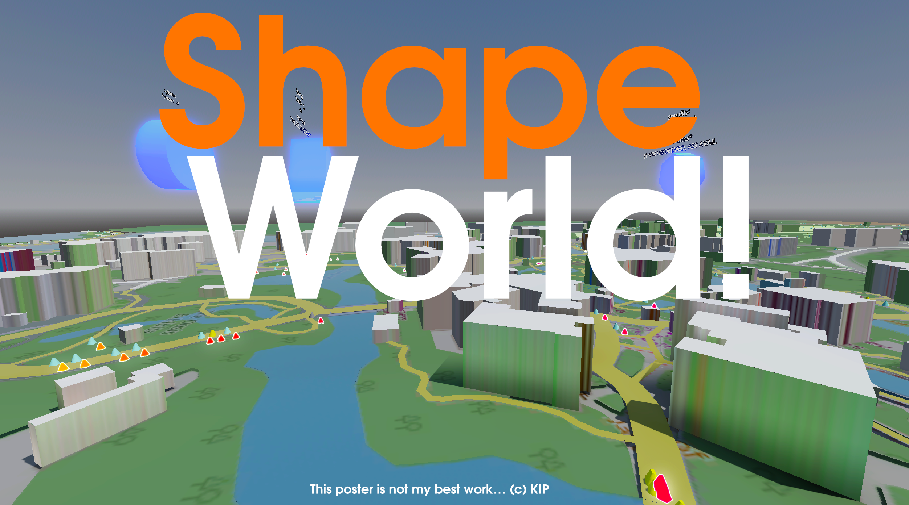
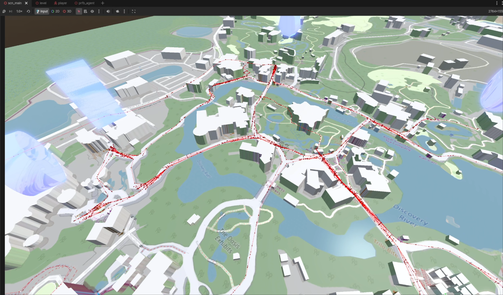

# Shapeworld!

A 3D realtime computer simulation of park guest agents in a certain industry leader's Safari-themed theme park.

Inspired by Defunctland's [shapeland](https://github.com/TouringPlans/shapeland), this project uses Godot to create a 
realtime simulation and visualization of every single park guest in a day. This project adds walk time into consideration,
along with the ability to check wait times and obtain fastpasses online, plus a slight variation on how fastpass is implemented.

Please note that unlike shapeland, this project has not been tuned to match real-world data.

Please go watch [Disney's FastPass: A Complicated History](https://www.youtube.com/watch?v=9yjZpBq1XBE).

---
3D map data from OpenStreetMap, [copyright OpenStreetMap and Contributors](https://www.openstreetmap.org/copyright).

# Support
> **Somehow it took me 2+ weeks to make this thing. If you liked it, considering buying me a ~~coffee~~ milktea!**
>
> \
> (https://kip.gay/support)

# Running
Shapeworld is designed to be ran in-editor since most configurations are too complicated to be changed through in-game UI.
Clone this project to your computer, and edit it with [Godot Editor 4.6.2 .NET](https://godotengine.org/download) or later.
> This project uses C#, make sure to download the .NET version.

This project has been designed with performance in mind (agents are rendered through GPU instancing, pathfinding data is cached), 
however performance heavily depends on how many agents are in the park plus your computer hardware.\
Disabling activity roaming can  dramatically improve performance, but this also influences agent behavior.

# Demo
### **For evaluation, I'm also providing a demo build of the executable with some preset simulation parameters. You can find it in [releases](https://github.com/KipJM/shapeworld/releases/latest).**

Specifically, high-speed simulation (path sampling) is on, there are 2500 agents max, and activity roaming is on.\
Use WASD / Controller to move around, check the help info on the top left.

Native Windows, Linux, and macOS builds are provided. For macOS users, please search online on running apps made by 
third-party developers who haven't paid Apple the 100-dollar compliance checking fee.

## License
**Copyright (c) KIP 2026.**

This project is licensed under [GNU General Public License v3.](https://www.gnu.org/licenses/gpl-3.0.en.html)

You are not allowed to use this project to train "Generative AI" or "LLM" machine learning models.\
This project is not affiliated with or endorsed by Defunctland or the Industry Leader (obviously) 

This project uses [expressobit's Modular Character Controller, MIT License.](https://github.com/expressobits/character-controller/tree/csharp)

## Features that this has but shapeland doesn't
### realtime 3D visualization
yeah

Agents are rendered through GPU instancing.

### **Walking and pathfinding**

- Agents spend time physically walking from ride to ride
- Agents will consider walking time to ride and back if they have a fastpass reservation
- (optional) agents will walk to a random point in the park to do activities 

Agents automatically pathfind through navmeshes to reach their destination. For slower simulation speeds, the agents
walk physically with obstacle avoidance to prevent bumping into other guests. For fast simulations, agents use path sampling
to move between waypoints, increasing performance.

Walktimes are considered in agents' behavior, such as planning around fastpasses. Walking has a backup timer, so that if
the agent can't make it to the target in time (estimated based on distance and walking speed), they'll be teleported.

Agents will also move to a random point on the navmesh to do their activities. This simulates going to a specific restaurant/POI,
and adds variability to how much time an activity will take. I forgot to limit the size of the navmesh so some agents will go outside the park
for activities. I found it kind of funny so I kept it.

### Online wait times checking and online fastpasses
Before committing and walking to the ride, the agent can check the wait times beforehands. If above balking point, the agent
either choose another ride to go to, or get a fastpass online without having to physically go to the ride. After getting the 
fp, the agent will immediately choose another ride to go to.

The online fastpass feature is most similar to that short mobile fastpass perk before FP+ was a thing mentioned in the video.
Keep in mind that it is still a _fastpass_, and not a skip the line option like what you'll find in Universal.

The availability of online features can be controlled, via both:
- Ride:
  - A ride can choose to support any set of these three: physical fastpass, online wait times checking, online fastpasses
- Agent:
  - Based on percentages, it will be randomly decided if an agent knows about online wait times or fastpasses features. If an agent knows about both, they automatically know how to obtain online fastpasses too.

### A different fastpass algorithm
See below.

### Agents have a more complex decision making process

#### plus some other stuff maybe
#### maybe more bugs than shapeland

## Features that shapeland has but this doesn't
- child/adult eligibility. All rides are assumed to be all ages.
- FastPass+ support out of the box: While agents are allowed to have 3 fastpasses at the same time by default, they will only get fastpasses if the standby is over their balking point. Agents are also not encouraged to get fastpasses ASAP unlike actual FP+
- There are less data collection/visualization features, such as a lack of final summary / graphs. However data is indeed stored within the managers, and it should be trivial to write some code to retrieve the data into csv based on your interests.

# ~~Warning~~ Info about fastpass algorithm

Shapeland implements fastpass under a few assumptions that works _well enough_ for getting data on fastpass's influence in
macro scale, but doesn't work for the real time simulation of shapeworld.

Shapeland assumes that 1. Agents will always redeem their fastpass on time, and 2. The FP/Standby ratio does not change.
Based on these assumptions, shapeland combines the virtual and physical FP queue into one.

> Virtual FP queue refers to basically the tickets, the physical FP queue refers to the way shorter
> physical line you'll have to wait in after redeeming your ticket

Shapeworld simulates the two queues individually, and the return window is calculated by estimating how much time it would take
for a guest at the end of a physical queue with the length of (FP virtual queue + physical queue) to ride, based on the FP ratio, 
**with a minimum of a 40 minute wait**. 

> Standby time calculation simulates the FP physical queue being filled up as time goes on, compared to shapeland, this
> is slower, but more accurate (will slightly overestimate compared to actual time, due to the nature of agents not redeeming their FPs)

Once guests come redeem their pass,
they're moved from the virtual queue to the physical FP queue, a queue similar to the standby queue except using the FP ratio.
This means that the virtual queue and physical queue are decoupled within shapeworld,
allowing more flexibility with how they're handled, for features such as:

- Shapeworld guests are given a return window instead of a return time like shapeland. They are allowed to redeem their ticket
at any time within a ~30 minute window.
- Shapeworld guests have the ability to miss their return windows, through underestimating their walking time or else.
- It's trivial to add special exceptions to the fastpass system, for example FP+ / VIP pass / paid express passes / boarding groups,
just by distributing fastpasses with arbitrary (or infinite) return windows.
- Support for online fastpasses, and **minimum fastpass wait times (read below)**.

Shapeland's fastpass system has another small issue, which is:

At a FP/Standby ratio of 8:2, before the two lines are saturated, it's almost always faster to ride a ride by getting a FP.
Shapeland's agents are designed to not exploit this quirk, but shapeworld's do. However to make things a bit more fair, I
added a minimum of 40 minute wait to fastpasses, similar to how the industry leader does it before rolling out FP+.

Shapeworld guests are not allowed to hold multiple FPs for the same ride at the same time.

# Architecture / customizing
Unlike shapeland, simulation configuration is split into many managers within shapeworld. Also unlike shapeland's data-driven simulation,
shapeworld create individual agents via OOP (honestly should've used ECS for this project) which operates independently.
While most events are driven by the minute tick, walking is simulated every real-world frame, with walking velocity scaled to match simulation speed.

Tooltips include important info, names of nodes are important.

Dictionaries in the format of [Profile, float] are typically probability distributions. Except for arrival seed, the densities do not have to add up to one.

- AgentManager: Agent spawning
- AgentProfiles: Global agent settings
  - children: possible agent profiles
- renderer_agent: GPU Instanced agent rendering
- Rides: Manage ride popularity
  - children: rides. Their position determine where agents will go to.
- Activities: basically the same thing
- TimeManager: when does the day start, when does the park close, when does the simulation end
  - IMPORTANT: minute delta: how many real world seconds is one simulated minute,
    - when delta is too small it will auto switch to high speed simulation mode

# Warning about california
You may find strings referencing a "california-themed theme park in the already california-themed california", or worse,
a "florida-themed theme park in the already florida-themed florida". Please disregard these strings, **be assured this project is about
and only about a certain magical Safari themed theme park.**

#### (c) KIP, 2026